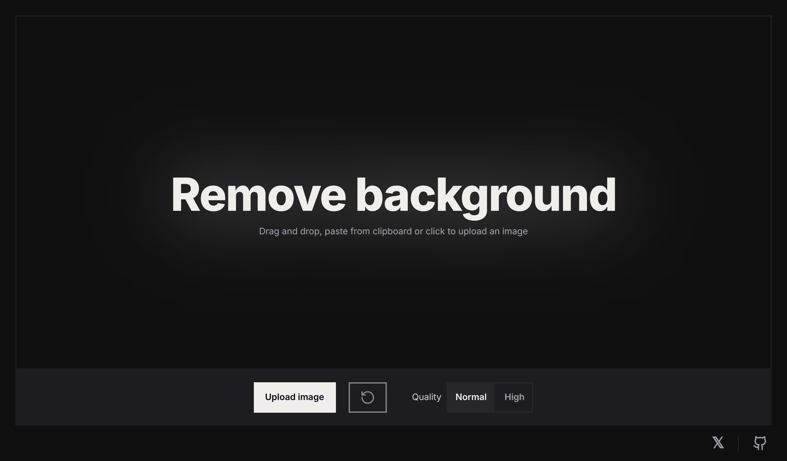

# Aether

Hey! This is Aether, a small web app that removes backgrounds from images with AI. It's built with:

* [BRIA AI's RMBG-1.4](https://huggingface.co/briaai/RMBG-1.4)
* [transformers.js](https://github.com/xenova/transformers.js)
* [Remix.run](https://remix.run)
* [Tailwind CSS](https://tailwindcss.com)
* [Lucide Icons](https://lucide.dev)
* [Vercel](https://vercel.com)

... and some sweat. Thanks to the authors of the libraries and tools used in this project!

The project is neither tested nor well commented, sorry about that. 😅

## Challenges and Learnings

The most challenging part of this project was to make the AI model work in the browser. Getting it to run wasn't too
hard with `onnxruntime-web`, but...

I had to learn a lot about how to handle the various image data types (`ImageData`, `ImageBitmap`, `CanvasImageSource`, `Uint8Array`, `Float32Array`, etc.) and not only the conversion
between binary data and tensors, but also the conversion between different tensor formats (NHWC, NCHW, etc.), image
formats (masks vs. RGBA) as well as resizing, handling the alpha channel, and working with Canvas. You have to fit the
input to the model's specific needs (`[N, 1, 1024, 1024]`), and the output to the next step's requirements, and so on. A lot of that is reflected in `app/components/features/rembg` and `app/components/shared/image.ts`.

I later switched to `transformers.js` because even though it worked when using `onnxruntime-web` directly, it failed on
iOS and Android without any exception or log. After some debugging, I switched to `transformers.js`. I'm aware they use
ONNX and Tensorflow.js under the hood, but it probably does so better than I do 😁 It provides ready-made pipelines, but
in this case, it didn't yet support `SegformerForSemanticSegmentation` in the image segmentation pipeline, which was
necessary for BRIA AI's RMBG-1.4 model. But! I still could use the right pre-processing manually, so I only had to do
the post processing.

As a plus, it now caches properly, works everywhere, and is even faster! Thanks to [xenova](https://github.com/xenova).

